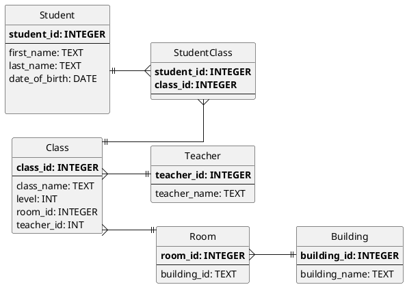

# ER Diagram

This is my diagram for my competitor app to KAMAR

```plantuml


@startuml
' config
hide circle
skinparam linetype ortho


left to right direction


entity "Student" {
<b>student_id: INTEGER</b>
--
first_name: TEXT
last_name: TEXT
date_of_birth: DATE


  }


entity "StudentClass" {
<b>student_id: INTEGER
<b>class_id: INTEGER
--
}


entity "Class" {
<b>class_id: INTEGER
--
class_name: TEXT
level: INT
room_id: INTEGER
teacher_id: INT
}


entity "Teacher" {
<b>teacher_id: INTEGER
--
teacher_name: TEXT
}


entity "Room" {
<b>room_id: INTEGER
--
building_id: TEXT
}


entity "Building" {
<b>building_id: INTEGER
--
building_name: TEXT
}


Student ||--{ StudentClass
Class ||--{ StudentClass
Class }--|| Teacher
Class }--|| Room
Room }--|| Building
@enduml
```
